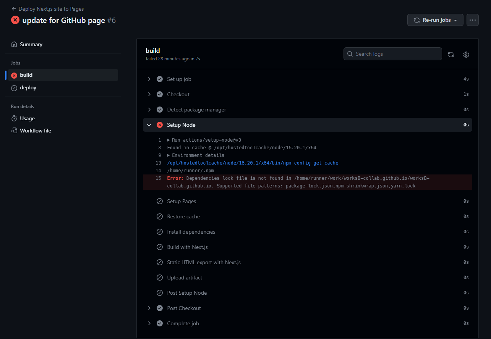

## GitHub Pages

an error will occur
in [this tutorial](https://medium.com/frontendweb/how-to-deploy-a-nextjs-app-to-github-pages-1de4f6ed762e).

```text
Error: Dependencies lock file is not found in /home/runner/work/worksB-collab.github.io/worksB-collab.github.io. Supported file patterns: package-lock.json,npm-shrinkwrap.json,yarn.lock
```



in order to run on GitHub Pages, we need to either commit `package-lock.json` to GitHub or create a `yarn.lock` in our
repository.

### generate yarn.lock

according
to [this](https://officialrajdeepsingh.dev/posts/how-to-generate-a-yarn-lock-file-based-on-a-package-json-file-for-npm-or-pnpm),
a `yarn.lock` file is can be created by `yarn generate-lock-entry >> yarn.lock` according to `package.json`.